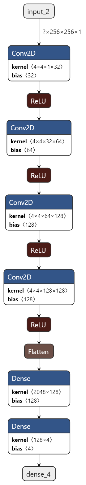
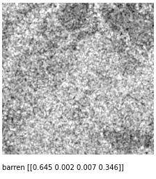
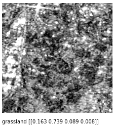
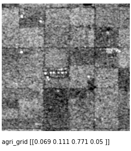
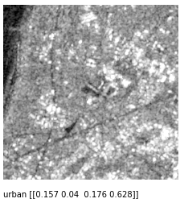

# SAR-Classifier
CNN to classifiy Synthetic Aperture Radar images based on terrain type. 
~8,000 images distributed evenly over 4 major types of terrain/regions: barren land, grasslands, agricultural land (grid type), and urban areas. 
Trained for 15 epochs with batch size = 3.

 

## Results

**( true class name ) [ barren score, grass score, agri score and urban score ]**

 
*predicted barren land*  
 
*predicted grassland*  
 
*predicted agricultural land*  
 
*predicted urban area*  
